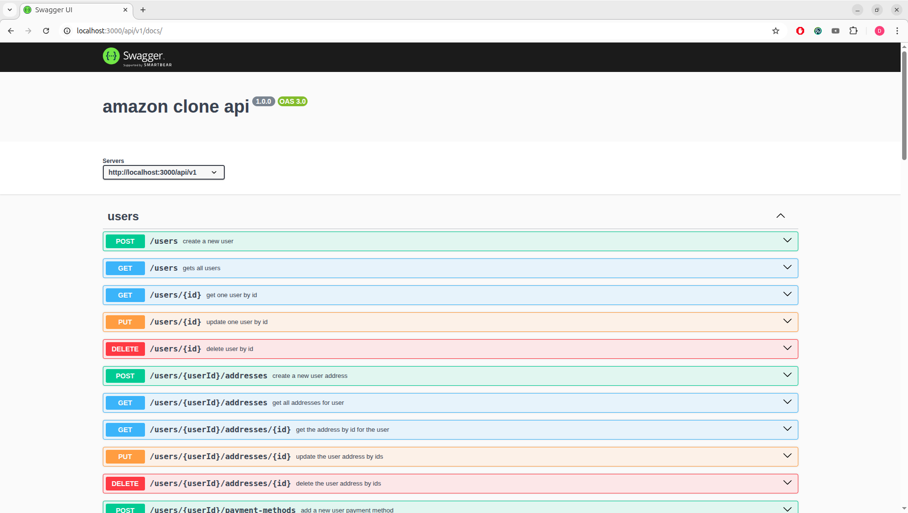

# amazon-backend-clone

## TODO:

- <s>db, sql, postgres, migrations, seed</s>
- <s>api, rest</s>
- <s>testing, unit, integration, mocking, jest</s>
- <s>docs, openapi/swagger spec</s>, installation guide

### Screenshot:

